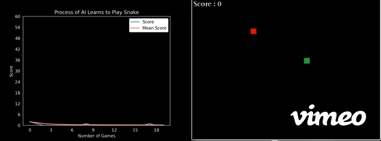
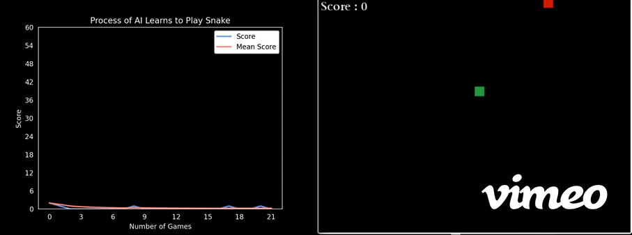
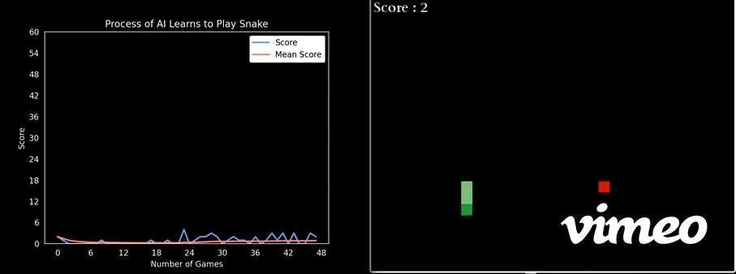
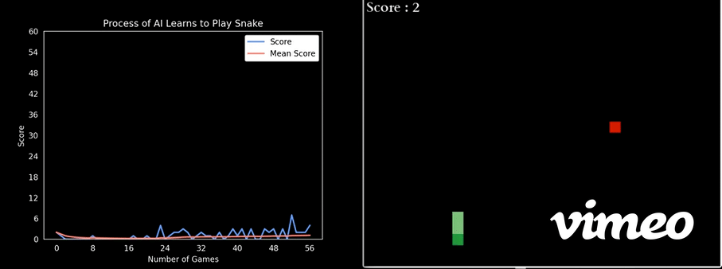
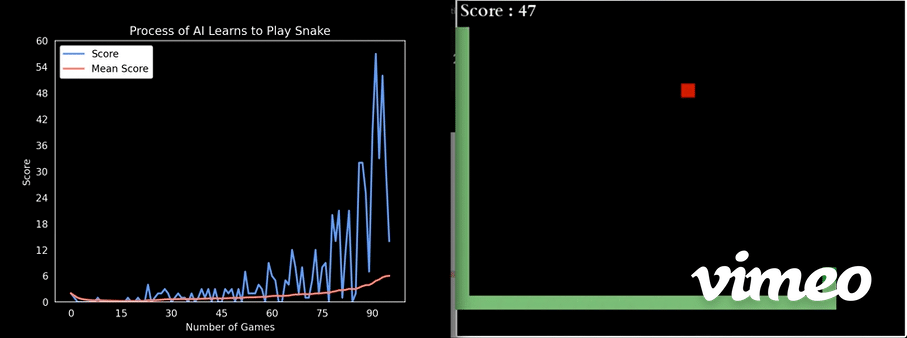
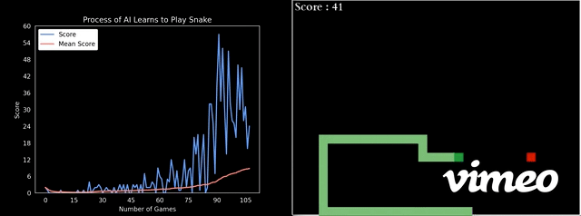
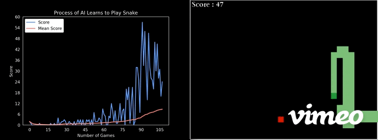
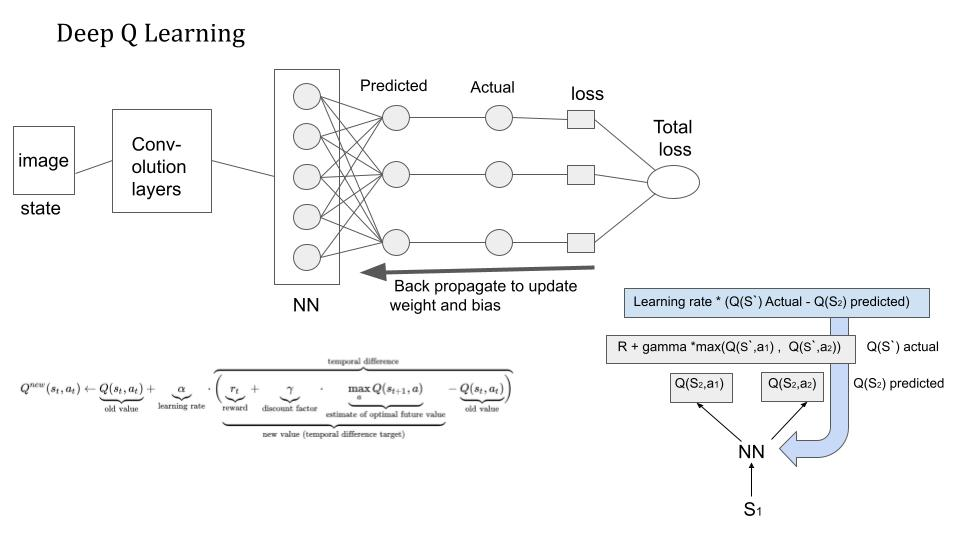

## AI Driven Snake Game using Deep Q Learning
<i>This project was adapted from Vedant Goswami's [tutorial](https://www.geeksforgeeks.org/ai-driven-snake-game-using-deep-q-learning/) and [code](https://github.com/vedantgoswami/SnakeGameAI). </i>

I use reinforcement learning to train a bot to play Snake game. The snake gets reward when she eats an apple, and gets penalty when she dies(either collide with her body or hit the wall). The goal of the game is to keep the snake alive as along as possible by not letting her hit with a wall or collide with her body.

## Game Rule:
    1. Snake has to move either forward, left or right.
    2. Snake dies when hits wall or her body.
    3. For every eaten apple, snake's length increases by 1 and a new apple is generated on a random unoccupied place.

## Training Results:

<pre> At the beignning, the snake knows nothing about the environment and moves randomly and always dies early by hitting the wall.</pre>

<pre>As she learns from mistakes, she starts to be aware of boundary and learns to walk along the wall while keeping herself safe.</pre>

<pre>As game counts reach over 70, she makes a major progress: she tries to reach the apple with fewest step as possible. But she easily runs to her long body.</pre>

<pre>As she keeps teaching herself through trial and error, she becomes a master of this game and even better than human. </pre>

## Design & Implementation: 

### About the Neutral Network:

I used Dense neural network with an input layer of size 11 and one dense layer with 256 neurons and output of 3 neurons. Each input and output neuron can have a value between 0 and 1, and each weight can have a value between -1 and 1.

    1. Input: The state of current game from environment is translated to array of size 11: 
           state = [danger_straight, danger_right, danger_left,   
                    curDir_left, curDir_right, curDir_up, curDir_down,
                    food_on_left, food_on_right, food_on_up, food_on_down]

    2. Hidden Layers: The hidden layers are activated by the ReLU activation function.

    3. Output: The output layer contains the three moves the snake can make (forward, left or Right) 
            output = [1, 0, 0] # [forward, turn right, turn left]

## Three Modules in this project:

1. The Environment: snake game that built with Pygame

2. The Agent (Intermediary between Environment and Model):
    * get_state(game): translate current game to state (array with 11 bolean values indicates danger, current direction & food)
    * get_action(state): call model for getting the next state of the snake
    * train(): 
        * Play the step predicted by the model in the environment
        * Store the current state, move performed and the reward
        * Train short memory

3. The Model (Reinforcement model built with PyTorch for move prediction):
    * create class Linear_Qnet:
        * init 2 layers linear neural network
        * forward(x): use activation function to output a prediction, given the input tensor x
    * save trained model as dictionary for future use
    * create class Trainer:
        * init model parameters: learning rate, discount rate, epilon(first exploration, then exploitation)
        * use Adam optimizer to update parameters and zeroes gradients
            * gradient-based optimization of stochastic objective functions
            * computes individual adaptive learning rates for different parameters
        * use Mean squared error loss function to backpropagate that loss to update weight
    * function train_step(): 
        * convert all to tensors (both tuples and a single value)
        * get the pre_Q from current state and use Bellman to calculate new_Q
        * use loss function(MSE) between new_Q & pre_Q, and backpropagate that loss to update weight and biases

## Notes & Highlight: 

Deep learning framework comparison: pyTorch vs. TensorFlow:
- pyTorch:
    - imperative programing: 
        perform computation as we type it (like most python) (more flexible)

    - dynamic computation graphing:    
        pyTorch is DEFINED BY RUN.
        variable length input + output use dynamic graph (recurrent network) 
        easy to debug
https://towardsdatascience.com/understanding-pytorch-with-an-example-a-step-by-step-tutorial-81fc5f8c4e8e

- TensorFlow:
    - symbolic programing: 
        clear seperation between defining computation graph and compiling it (very efficient due to reusability)

    - static graphs:
        TensorFlow is DEFINED AND RUN.
        static graph work wells for fixed-size feedforward and convolutional network

